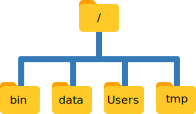

파일과 디렉토리 관리를 담당하고 있는 운영체제 부분을 **파일 시스템(file system)**이라고 한다. 
파일 시스템은 데이터를 정보를 담고 있는 파일과 파일 혹은 다른 디렉토리를 담고 있는 디렉토리(혹은 "폴더"")로 조직화한다.

파일과 디렉토리를 생성, 검사, 이름 바꾸기, 삭제하는데 명령어 몇개가 자주 사용된다. 
명령어를 살펴보기 위해, 쉘 윈도우를 연다:

먼저, `pwd` 명령어를 사용해서 위치를 찾아낸다; `pwd`는 "print working directory"를 의미한다.
디렉토리는 *장소(place)* 같다 - 
쉘을 사용할 때마다 정확하게 한 장소에 위치하게 되는데, 
이를 **현재 작업 디렉토리(current working directory)**라고 부른다.
명령어 대부분은 현재 작업 디렉토리에 파일을 읽고 쓰는 작업을 "이곳(here)"에 수행한다.
그래서 명령어를 실행하기 전에 현재 위치가 어디인지 파악하는 것이 중요하다.
`pwd` 명령어를 숳애하게 되면 현재 위치를 다음과 같이 보여주게 된다:

~~~
$ pwd
~~~
{: .language-bash}

~~~
/Users/nelle
~~~
{: .output}

다음에서, 컴퓨터의 응답은 `/Users/nelle`으로 넬(Nelle)의 **홈 디렉토리(home directory)**다:

> ## 홈 디렉토리(Home Directory) 변종
>
> 
> 홈 디렉토리 경로는 운영체제마다 다르게 보인다.
> 리눅스에서 `/home/nelle` 처럼 보이고, 윈도우에서는 
> `C:\Documents and Settings\nelle`, `C:\Users\nelle`와 유사하게 보인다.
> (윈도우 버젼마다 다소 차이가 있을 수 있음에 주목한다.)
> 다음 예제부터, 맥OS 출력결과를 기본설정으로 사용할 것이다; 
> 리눅스와 윈도우 출력결과에 다소 차이가 날 수 있지만, 전반적으로 유사하다.
{: .callout}

"홈 디렉토리(home directory)"를 이해하기 위해서, 
파일 시스템이 전체적으로 어떻게 구성되었는지 살펴보자. 
최상단에 다른 모든 것을 담고 있는 **루트 디렉토리(root directory)**가 있다. 
슬래쉬 `/` 문자로 나타내고, `/users/nelle`에서 맨 앞에 슬래쉬이기도 하다.

Nelle 과학자 컴퓨터의 파일시스템을 사례로 살펴보자. 
시연을 통해서 유사한 방식으로 (하지만 정확하게 동일하지는 않지만) 본인 컴퓨터
파일시스템을 탐색하는 명령어를 학습하게 된다.

넬 과학자 컴퓨터의 파일 시스템은 다음과 같다:

최상단에 다른 모든 것을 담고 있는 **루트 디렉토리(root directory)**가 있다. 
슬래쉬 `/` 문자로 나타내고, `/users/nelle`에서 맨 앞에 슬래쉬이기도 하다.

홈 디렉토리 안쪽에 몇가지 다른 디렉토리가 있다:
`bin` (몇몇 내장 프로그램이 저장된 디렉토리), 
`data` (여러가지 데이터 파일이 저장된 디렉토리), 
`Users` (사용자의 개인 디렉토리가 저장된 디렉토리), 
`tmp` (장기간 저장될 필요가 없는 임시 파일을 위한 디렉토리), 등등:

현재 작업 디렉토리 `/Users/nelle`는 `/Users` 내부에 저장되어 있다는 것을 알고 있는데, 
이유는 `/Users`가 이름 처음 부분이기 때문에 알 수 있다. 
마찬가지로 `/Users`는 루트 디렉토리 내부에 저장되어 있다는 것을 알 수 있는데, 이름이 `/`으로 시작되기 때문이다.

> ## 슬래쉬(Slashes)
>
> 슬래쉬 `/` 문자는 두가지 의미가 있는 것에 주목한다.
> 파일 혹은 디렉토리 이름 앞에 나타날 때, 루트 디렉토리를 지칭하게 되고,
> 이름 *가운데* 나타날 때, 단순히 구분자 역할을 수행한다.
{: .callout}

`/Users` 하단에서 Nelle 과학자 컴퓨터 계정과, 랩실 동료 미이라(Mummy)와 늑대인간(Wolfman) 디렉토리를 볼 수 있다.

미이라(Mummy) 파일은 `/Users/imhotep` 디렉토리에 저장되어 있고, 
늑대인가(Wolfman)의 파일은 `/Users/larry` 디렉토리에 저장되어 있고 
`/Users/nelle` 디렉토리에 `nelle`의 정보가 저장되어 있는데,
이것이 왜 `nelle`이 디렉토리 이름의 마지막 부분인 이유다.
일반적으로 명령 프롬프트를 열게 되면, 처음 시작하는 곳이 본인 계정 홈 디렉토리가 된다.

본인 파일시스템에 담긴 내용물을 파악하는데 사용하는 명령어를 학습해 보자.
(Nelle의 홈 디렉토리에 무엇이 있는지 `ls` 명령어를 실행해서 살펴보자.)
`ls`는 "목록보기(listing)"를 나타낸다:

~~~
$ ls
~~~
{: .language-bash}

~~~
Applications Documents    Library      Music        Public
Desktop      Downloads    Movies       Pictures
~~~
{: .output}

(다시 한번, 본인 컴퓨터 운영체제와 파일시스템을 취향에 따라 바꿨는지에 따라 
출력결과는 다소 다를 수 있다.)

`ls`는 알파벳 순서로 깔끔하게 열로 정렬하여 현재 디렉토리에 있는 파일과 디렉토리 이름을 출력한다.
**플래그(flag)** `-F`(**스위치(switch)** 혹은 **옵션(option)**으로도 불린다)를 추가하여 출력을 좀더 이해하기 좋게 출력괄를 생성할 수도 있다. 
`ls`으로 하여금 디렉토리 이름 뒤에 `/`을 추가하게 일러준다:
끝에 붙은 `/`은 디렉토리라는 것을 지칭한다.
설정에 따라 달라지도록 파일이냐 디렉토리냐에 따라 다른 색상을 입힐 수도 있다.
앞선 학습에서 `ls -F` 명령어를 사용한 것을 상기한다.

~~~
$ ls -F
~~~
{: .language-bash}

~~~
Applications/ Documents/    Library/      Music/        Public/
Desktop/      Downloads/    Movies/       Pictures/
~~~
{: .output}

### 도움말 얻기

`ls` 명령어에 딸린 **플래그**가 많다.
일반적으로 명령어와 수반되는 플래그 사용법을 파악하는 방식이 두개 있다:

1. `--help` 플래그를 명령어에 다음과 같이 전달하는 방법:
    ~~~
    $ ls --help
    ~~~
    {: .bash}

2. `man` 명령어로 다음과 같이 매뉴얼을 읽는 방법:
    ~~~
    $ man ls 
    ~~~
    {: .bash}

**본인 컴퓨터 환경에 따라 상기 방법 중 하나만 동작(`man` 혹은 `--help`)할 수도 있다.**
아래에서 두가지 방법 모두 살펴보자.

#### `--help` 플래그

배쉬 내부에서 동작하도록 작성된 배쉬 명령어와 프로그램은 `--help` 플래그를 지원해서 
명령어 혹은 프로그램을 사용하는 방식에 대한 더 많은 정보를 볼 수 있게 해 준다.

~~~
$ ls --help
~~~
{: .language-bash}

~~~
Usage: ls [OPTION]... [FILE]...
List information about the FILEs (the current directory by default).
Sort entries alphabetically if none of -cftuvSUX nor --sort is specified.

Mandatory arguments to long options are mandatory for short options too.
  -a, --all                  do not ignore entries starting with .
  -A, --almost-all           do not list implied . and ..
      --author               with -l, print the author of each file
  -b, --escape               print C-style escapes for nongraphic characters
      --block-size=SIZE      scale sizes by SIZE before printing them; e.g.,
                               '--block-size=M' prints sizes in units of
                               1,048,576 bytes; see SIZE format below
  -B, --ignore-backups       do not list implied entries ending with ~
  -c                         with -lt: sort by, and show, ctime (time of last
                               modification of file status information);
                               with -l: show ctime and sort by name;
                               otherwise: sort by ctime, newest first
  -C                         list entries by columns
      --color[=WHEN]         colorize the output; WHEN can be 'always' (default
                               if omitted), 'auto', or 'never'; more info below
  -d, --directory            list directories themselves, not their contents
  -D, --dired                generate output designed for Emacs' dired mode
  -f                         do not sort, enable -aU, disable -ls --color
  -F, --classify             append indicator (one of */=>@|) to entries
      --file-type            likewise, except do not append '*'
      --format=WORD          across -x, commas -m, horizontal -x, long -l,
                               single-column -1, verbose -l, vertical -C
      --full-time            like -l --time-style=full-iso
  -g                         like -l, but do not list owner
      --group-directories-first
                             group directories before files;
                               can be augmented with a --sort option, but any
                               use of --sort=none (-U) disables grouping
  -G, --no-group             in a long listing, don't print group names
  -h, --human-readable       with -l and/or -s, print human readable sizes
                               (e.g., 1K 234M 2G)
      --si                   likewise, but use powers of 1000 not 1024
  -H, --dereference-command-line
                             follow symbolic links listed on the command line
      --dereference-command-line-symlink-to-dir
                             follow each command line symbolic link
                               that points to a directory
      --hide=PATTERN         do not list implied entries matching shell PATTERN
                               (overridden by -a or -A)
      --indicator-style=WORD  append indicator with style WORD to entry names:
                               none (default), slash (-p),
                               file-type (--file-type), classify (-F)
  -i, --inode                print the index number of each file
  -I, --ignore=PATTERN       do not list implied entries matching shell PATTERN
  -k, --kibibytes            default to 1024-byte blocks for disk usage
  -l                         use a long listing format
  -L, --dereference          when showing file information for a symbolic
                               link, show information for the file the link
                               references rather than for the link itself
  -m                         fill width with a comma separated list of entries
  -n, --numeric-uid-gid      like -l, but list numeric user and group IDs
  -N, --literal              print raw entry names (don't treat e.g. control
                               characters specially)
  -o                         like -l, but do not list group information
  -p, --indicator-style=slash
                             append / indicator to directories
  -q, --hide-control-chars   print ? instead of nongraphic characters
      --show-control-chars   show nongraphic characters as-is (the default,
                               unless program is 'ls' and output is a terminal)
  -Q, --quote-name           enclose entry names in double quotes
      --quoting-style=WORD   use quoting style WORD for entry names:
                               literal, locale, shell, shell-always,
                               shell-escape, shell-escape-always, c, escape
  -r, --reverse              reverse order while sorting
  -R, --recursive            list subdirectories recursively
  -s, --size                 print the allocated size of each file, in blocks
  -S                         sort by file size, largest first
      --sort=WORD            sort by WORD instead of name: none (-U), size (-S),
                               time (-t), version (-v), extension (-X)
      --time=WORD            with -l, show time as WORD instead of default
                               modification time: atime or access or use (-u);
                               ctime or status (-c); also use specified time
                               as sort key if --sort=time (newest first)
      --time-style=STYLE     with -l, show times using style STYLE:
                               full-iso, long-iso, iso, locale, or +FORMAT;
                               FORMAT is interpreted like in 'date'; if FORMAT
                               is FORMAT1<newline>FORMAT2, then FORMAT1 applies
                               to non-recent files and FORMAT2 to recent files;
                               if STYLE is prefixed with 'posix-', STYLE
                               takes effect only outside the POSIX locale
  -t                         sort by modification time, newest first
  -T, --tabsize=COLS         assume tab stops at each COLS instead of 8
  -u                         with -lt: sort by, and show, access time;
                               with -l: show access time and sort by name;
                               otherwise: sort by access time, newest first
  -U                         do not sort; list entries in directory order
  -v                         natural sort of (version) numbers within text
  -w, --width=COLS           set output width to COLS.  0 means no limit
  -x                         list entries by lines instead of by columns
  -X                         sort alphabetically by entry extension
  -Z, --context              print any security context of each file
  -1                         list one file per line.  Avoid '\n' with -q or -b
      --help     display this help and exit
      --version  output version information and exit

The SIZE argument is an integer and optional unit (example: 10K is 10*1024).
Units are K,M,G,T,P,E,Z,Y (powers of 1024) or KB,MB,... (powers of 1000).

Using color to distinguish file types is disabled both by default and
with --color=never.  With --color=auto, ls emits color codes only when
standard output is connected to a terminal.  The LS_COLORS environment
variable can change the settings.  Use the dircolors command to set it.

Exit status:
 0  if OK,
 1  if minor problems (e.g., cannot access subdirectory),
 2  if serious trouble (e.g., cannot access command-line argument).

GNU coreutils online help: <http://www.gnu.org/software/coreutils/>
Full documentation at: <http://www.gnu.org/software/coreutils/ls>
or available locally via: info '(coreutils) ls invocation'
~~~
{: .output}

> ## 지원되지 않는 명령-라인 선택옵션
> 지원되지 않는 선택옵션(플래그)를 사용하게 되면, `ls`를 비롯한 다른 프로그램은 
> 다음과 같은 오류 메시지를 일반적으로 출력하게 된다:
>
> ~~~
> $ ls -j
> ~~~
> {: .language-bash}
> 
> ~~~
> ls: invalid option -- 'j'
> Try 'ls --help' for more information.
> ~~~
> {: .error}
{: .callout}

#### `man` 명령어

`ls`에 대해 배울 수 있는 다른 방식은 다음 명령어를 타이핑하는 것이다.

~~~
$ man ls
~~~
{: .bash}

상기 명령어를 실행하게 되면 `ls` 명령어와 선택 옵션에 대해 기술된 페이지로 
탈바꿈하게 된다. 만약 운이 좋은 경우 상용법에 대한 예제도 포함되어 있다.

`man` 페이지를 살펴보는 방법은 행단위로 이동하는데 <kbd>↑</kbd>, <kbd>↓</kbd>을 사용하거나 
전체 페이지 단위로 건너뛰거나 아래 페이지로 이동할 경우 <kbd>B</kbd>, <kbd>Spacebar</kbd>을 사용한다.
`man` 페이지에서 단어나 문자를 찾는 경우 <kbd>/</kbd> 다음에 검색할 문자 혹은 단어를 타이핑하면 된다.

`man` 페이지에서 빠져 나오고자 **종료(quit)**하고자 한다면 <kbd>Q</kbd>을 누른다. 

> ## 웹상의 매뉴얼 페이지
>
> 물론 명령어에 대한 도움말에 접근하는 세번째 방식이 있다:
> 웹브라우저를 통해서 인터넷을 검색하는 것이다.
> 인터넷 검색을 이용할 때, 검색쿼리에 `unix man page` 문구를 
> 포함할 경우 연관된 정보를 찾는데 도움이 될 수 있다.
>
> GNU도 [GNU 핵심 유틸리티(core GNU utilities)](http://www.gnu.org/software/coreutils/manual/coreutils.html)이 
> 포함된 [매뉴얼](http://www.gnu.org/manual/manual.html)을 제공하고 있는데
> 이번 학습에 소개된 많은 명령어를 망라하고 있다.
{: .callout}

> ## 더많은 `ls` 플래그 탐색
>
> `-l`, `-h` 플래그를 붙여 `ls` 명령어를 수행하게 되면 출력결과는 어떻게 나올까?
>
> 출력결과의 일부는 이번 학습에서 다루지 않는 속성(property)에 대한 것으로 파일 권한과 파일 소유에 대한 것이다.
> 그럼에도 불구하고 나머지는 유용할 것이다.
>
> > ## 해답 
> > `ls`와 사용되는 `-l` 플래그는 **l**ong을 축약한 것으로 
> > 파일/디렉토리 명칭 뿐만 아니라 파일 크기, 최종 변경 시간 같은 부가정보가 출력된다.
> > `-h` 플래그는 "**h**uman readable" 사람이 읽기 편한 형태로 파일크기를 지정한다.
> > 예를 들어, `5369` 대신에 `5.3K`이 화면에 출력된다.
> {: .solution}
{: .challenge}

> ## Listing Recursively and By Time
>
> The command `ls -R` lists the contents of directories recursively, i.e., lists
> their sub-directories, sub-sub-directories, and so on at each level. The command
> `ls -t` lists things by time of last change, with most recently changed files or
> directories first.
> In what order does `ls -R -t` display things? Hint: `ls -l` uses a long listing
> format to view timestamps.
>
> > ## Solution
> > The files/directories in each directory are sorted by time of last change.
> {: .solution}
{: .challenge}

Here,
we can see that our home directory contains mostly **sub-directories**.
Any names in your output that don't have trailing slashes,
are plain old **files**.
And note that there is a space between `ls` and `-F`:
without it,
the shell thinks we're trying to run a command called `ls-F`,
which doesn't exist.

We can also use `ls` to see the contents of a different directory.  Let's take a
look at our `Desktop` directory by running `ls -F Desktop`,
i.e.,
the command `ls` with the `-F` **flag** and the **argument**  `Desktop`.
The argument `Desktop` tells `ls` that
we want a listing of something other than our current working directory:

~~~
$ ls -F Desktop
~~~
{: .language-bash}

~~~
data-shell/
~~~
{: .output}

Your output should be a list of all the files and sub-directories on your
Desktop, including the `data-shell` directory you downloaded at
the [setup for this lesson]({{ page.root }}).  Take a look at your Desktop to confirm that
your output is accurate.  

As you may now see, using a bash shell is strongly dependent on the idea that
your files are organized in a hierarchical file system.
Organizing things hierarchically in this way helps us keep track of our work:
it's possible to put hundreds of files in our home directory,
just as it's possible to pile hundreds of printed papers on our desk,
but it's a self-defeating strategy.

Now that we know the `data-shell` directory is located on our Desktop, we
can do two things.  

First, we can look at its contents, using the same strategy as before, passing
a directory name to `ls`:

~~~
$ ls -F Desktop/data-shell
~~~
{: .language-bash}

~~~
creatures/          molecules/          notes.txt           solar.pdf
data/               north-pacific-gyre/ pizza.cfg           writing/
~~~
{: .output}

Second, we can actually change our location to a different directory, so
we are no longer located in
our home directory.  

The command to change locations is `cd` followed by a
directory name to change our working directory.
`cd` stands for "change directory",
which is a bit misleading:
the command doesn't change the directory,
it changes the shell's idea of what directory we are in.

Let's say we want to move to the `data` directory we saw above.  We can
use the following series of commands to get there:

~~~
$ cd Desktop
$ cd data-shell
$ cd data
~~~
{: .language-bash}

These commands will move us from our home directory onto our Desktop, then into
the `data-shell` directory, then into the `data` directory.  `cd` doesn't print anything,
but if we run `pwd` after it, we can see that we are now
in `/Users/nelle/Desktop/data-shell/data`.
If we run `ls` without arguments now,
it lists the contents of `/Users/nelle/Desktop/data-shell/data`,
because that's where we now are:

~~~
$ pwd
~~~
{: .language-bash}

~~~
/Users/nelle/Desktop/data-shell/data
~~~
{: .output}

~~~
$ ls -F
~~~
{: .language-bash}

~~~
amino-acids.txt   elements/     pdb/	        salmon.txt
animals.txt       morse.txt     planets.txt     sunspot.txt
~~~
{: .output}

We now know how to go down the directory tree, but
how do we go up?  We might try the following:

~~~
$ cd data-shell
~~~
{: .language-bash}

~~~
-bash: cd: data-shell: No such file or directory
~~~
{: .error}

But we get an error!  Why is this?  

With our methods so far,
`cd` can only see sub-directories inside your current directory.  There are
different ways to see directories above your current location; we'll start
with the simplest.  

There is a shortcut in the shell to move up one directory level
that looks like this:

~~~
$ cd ..
~~~
{: .language-bash}

`..` is a special directory name meaning
"the directory containing this one",
or more succinctly,
the **parent** of the current directory.
Sure enough,
if we run `pwd` after running `cd ..`, we're back in `/Users/nelle/Desktop/data-shell`:

~~~
$ pwd
~~~
{: .language-bash}

~~~
/Users/nelle/Desktop/data-shell
~~~
{: .output}

The special directory `..` doesn't usually show up when we run `ls`.  If we want
to display it, we can give `ls` the `-a` flag:

~~~
$ ls -F -a
~~~
{: .language-bash}

~~~
./   .bash_profile  data/       north-pacific-gyre/  pizza.cfg  thesis/
../  creatures/     molecules/  notes.txt            solar.pdf  writing/
~~~
{: .output}

`-a` stands for "show all";
it forces `ls` to show us file and directory names that begin with `.`,
such as `..` (which, if we're in `/Users/nelle`, refers to the `/Users` directory)
As you can see,
it also displays another special directory that's just called `.`,
which means "the current working directory".
It may seem redundant to have a name for it,
but we'll see some uses for it soon.

Note that in most command line tools, multiple flags can be combined 
with a single `-` and no spaces between the flags: `ls -F -a` is 
equivalent to `ls -Fa`.

> ## Other Hidden Files
>
> In addition to the hidden directories `..` and `.`, you may also see a file
> called `.bash_profile`. This file usually contains shell configuration
> settings. You may also see other files and directories beginning
> with `.`. These are usually files and directories that are used to configure
> different programs on your computer. The prefix `.` is used to prevent these
> configuration files from cluttering the terminal when a standard `ls` command
> is used.
{: .callout}

> ## Orthogonality
>
> The special names `.` and `..` don't belong to `cd`;
> they are interpreted the same way by every program.
> For example,
> if we are in `/Users/nelle/data`,
> the command `ls ..` will give us a listing of `/Users/nelle`.
> When the meanings of the parts are the same no matter how they're combined,
> programmers say they are **orthogonal**:
> Orthogonal systems tend to be easier for people to learn
> because there are fewer special cases and exceptions to keep track of.
{: .callout}

These then, are the basic commands for navigating the filesystem on your computer:
`pwd`, `ls` and `cd`.  Let's explore some variations on those commands.  What happens
if you type `cd` on its own, without giving
a directory?  

~~~
$ cd
~~~
{: .language-bash}

How can you check what happened?  `pwd` gives us the answer!  

~~~
$ pwd
~~~
{: .language-bash}

~~~
/Users/nelle
~~~
{: .output}

It turns out that `cd` without an argument will return you to your home directory,
which is great if you've gotten lost in your own filesystem.  

Let's try returning to the `data` directory from before.  Last time, we used
three commands, but we can actually string together the list of directories
to move to `data` in one step:

~~~
$ cd Desktop/data-shell/data
~~~
{: .language-bash}

Check that we've moved to the right place by running `pwd` and `ls -F`  

If we want to move up one level from the data directory, we could use `cd ..`.  But
there is another way to move to any directory, regardless of your
current location.  

So far, when specifying directory names, or even a directory path (as above),
we have been using **relative paths**.  When you use a relative path with a command
like `ls` or `cd`, it tries to find that location  from where we are,
rather than from the root of the file system.  

However, it is possible to specify the **absolute path** to a directory by
including its entire path from the root directory, which is indicated by a
leading slash.  The leading `/` tells the computer to follow the path from
the root of the file system, so it always refers to exactly one directory,
no matter where we are when we run the command.

This allows us to move to our `data-shell` directory from anywhere on
the filesystem (including from inside `data`).  To find the absolute path
we're looking for, we can use `pwd` and then extract the piece we need
to move to `data-shell`.  

~~~
$ pwd
~~~
{: .language-bash}

~~~
/Users/nelle/Desktop/data-shell/data
~~~
{: .output}

~~~
$ cd /Users/nelle/Desktop/data-shell
~~~
{: .language-bash}

Run `pwd` and `ls -F` to ensure that we're in the directory we expect.  

> ## Two More Shortcuts
>
> The shell interprets the character `~` (tilde) at the start of a path to
> mean "the current user's home directory". For example, if Nelle's home
> directory is `/Users/nelle`, then `~/data` is equivalent to
> `/Users/nelle/data`. This only works if it is the first character in the
> path: `here/there/~/elsewhere` is *not* `here/there/Users/nelle/elsewhere`.
>
> Another shortcut is the `-` (dash) character.  `cd` will translate `-` into
> *the previous directory I was in*, which is faster than having to remember,
> then type, the full path.  This is a *very* efficient way of moving back
> and forth between directories. The difference between `cd ..` and `cd -` is
> that the former brings you *up*, while the latter brings you *back*. You can
> think of it as the *Last Channel* button on a TV remote.
{: .callout}

> ## Absolute vs Relative Paths
>
> Starting from `/Users/amanda/data/`,
> which of the following commands could Amanda use to navigate to her home directory,
> which is `/Users/amanda`?
>
> 1. `cd .`
> 2. `cd /`
> 3. `cd /home/amanda`
> 4. `cd ../..`
> 5. `cd ~`
> 6. `cd home`
> 7. `cd ~/data/..`
> 8. `cd`
> 9. `cd ..`
>
> > ## Solution
> > 1. No: `.` stands for the current directory.
> > 2. No: `/` stands for the root directory.
> > 3. No: Amanda's home directory is `/Users/amanda`.
> > 4. No: this goes up two levels, i.e. ends in `/Users`.
> > 5. Yes: `~` stands for the user's home directory, in this case `/Users/amanda`.
> > 6. No: this would navigate into a directory `home` in the current directory if it exists.
> > 7. Yes: unnecessarily complicated, but correct.
> > 8. Yes: shortcut to go back to the user's home directory.
> > 9. Yes: goes up one level.
> {: .solution}
{: .challenge}

> ## Relative Path Resolution
>
> Using the filesystem diagram below, if `pwd` displays `/Users/thing`,
> what will `ls -F ../backup` display?
>
> 1.  `../backup: No such file or directory`
> 2.  `2012-12-01 2013-01-08 2013-01-27`
> 3.  `2012-12-01/ 2013-01-08/ 2013-01-27/`
> 4.  `original/ pnas_final/ pnas_sub/`
>
> 
>
> > ## Solution
> > 1. No: there *is* a directory `backup` in `/Users`.
> > 2. No: this is the content of `Users/thing/backup`,
> >    but with `..` we asked for one level further up.
> > 3. No: see previous explanation.
> > 4. Yes: `../backup/` refers to `/Users/backup/`.
> {: .solution}
{: .challenge}

> ## `ls` Reading Comprehension
>
> Assuming a directory structure as in the above Figure
> (File System for Challenge Questions), if `pwd` displays `/Users/backup`,
> and `-r` tells `ls` to display things in reverse order,
> what command will display:
>
> ~~~
> pnas_sub/ pnas_final/ original/
> ~~~
> {: .output}
>
> 1.  `ls pwd`
> 2.  `ls -r -F`
> 3.  `ls -r -F /Users/backup`
> 4.  Either #2 or #3 above, but not #1.
>
> > ## Solution
> >  1. No: `pwd` is not the name of a directory.
> >  2. Yes: `ls` without directory argument lists files and directories
> >     in the current directory.
> >  3. Yes: uses the absolute path explicitly.
> >  4. Correct: see explanations above.
> {: .solution}
{: .challenge}

### Nelle's Pipeline: Organizing Files

Knowing just this much about files and directories,
Nelle is ready to organize the files that the protein assay machine will create.
First,
she creates a directory called `north-pacific-gyre`
(to remind herself where the data came from).
Inside that,
she creates a directory called `2012-07-03`,
which is the date she started processing the samples.
She used to use names like `conference-paper` and `revised-results`,
but she found them hard to understand after a couple of years.
(The final straw was when she found herself creating
a directory called `revised-revised-results-3`.)

> ## Sorting Output
>
> Nelle names her directories "year-month-day",
> with leading zeroes for months and days,
> because the shell displays file and directory names in alphabetical order.
> If she used month names,
> December would come before July;
> if she didn't use leading zeroes,
> November ('11') would come before July ('7'). Similarly, putting the year first
> means that June 2012 will come before June 2013.
{: .callout}

Each of her physical samples is labelled according to her lab's convention
with a unique ten-character ID,
such as "NENE01729A".
This is what she used in her collection log
to record the location, time, depth, and other characteristics of the sample,
so she decides to use it as part of each data file's name.
Since the assay machine's output is plain text,
she will call her files `NENE01729A.txt`, `NENE01812A.txt`, and so on.
All 1520 files will go into the same directory.

Now in her current directory `data-shell`,
Nelle can see what files she has using the command:

~~~
$ ls north-pacific-gyre/2012-07-03/
~~~
{: .language-bash}

This is a lot to type,
but she can let the shell do most of the work through what is called **tab completion**.
If she types:

~~~
$ ls nor
~~~
{: .language-bash}

and then presses tab (the tab key on her keyboard),
the shell automatically completes the directory name for her:

~~~
$ ls north-pacific-gyre/
~~~
{: .language-bash}

If she presses tab again,
Bash will add `2012-07-03/` to the command,
since it's the only possible completion.
Pressing tab again does nothing,
since there are 19 possibilities;
pressing tab twice brings up a list of all the files,
and so on.
This is called **tab completion**,
and we will see it in many other tools as we go on.
